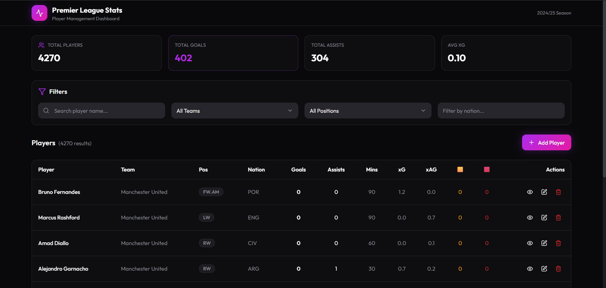

# PremierLeague

PremierLeague is a full-stack project for studying Premier League player stats. It provides a backend API for managing player data and a React frontend for browsing, filtering, and editing records.



## Features
- Backend: Spring Boot REST API for CRUD operations and filtered queries.
- Database: PostgreSQL persistence with JPA.
- Frontend: React + TypeScript + Vite UI for listing, searching, and managing players.

## Repository Layout
- Frontend (Vite): `PL_FrontEnd`
- Backend (Spring Boot): `PL_BackEnd`

## Requirements
- Node.js 18+
- npm
- Java 21
- PostgreSQL 14+

## Backend Setup (Spring Boot)
1) Configure PostgreSQL (defaults in `PL_BackEnd/src/main/resources/application.properties`):
   - Database: `players_stats`
   - Username: `postgres`
   - Password: set `DB_PASSWORD` in your environment
2) Start the backend:
```sh
cd PL_BackEnd
./mvnw spring-boot:run
```
Backend runs on `http://localhost:8080`.

## Frontend Setup (Vite)
1) Install dependencies:
```sh
cd PL_FrontEnd
npm install
```
2) Start the dev server:
```sh
npm run dev
```
Frontend runs on `http://localhost:5173`.
